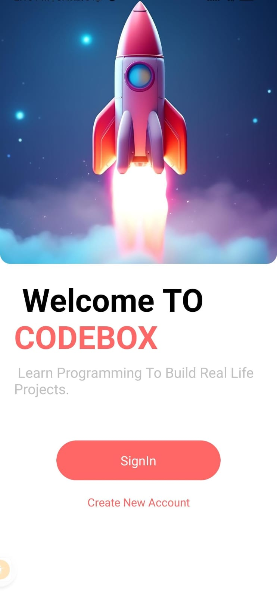
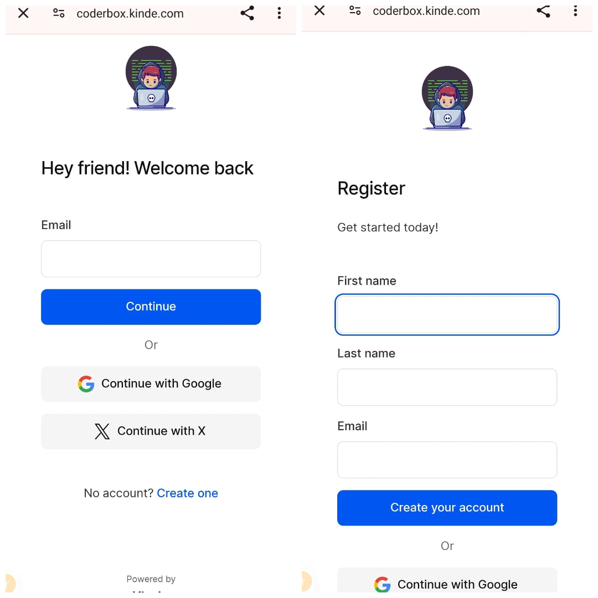
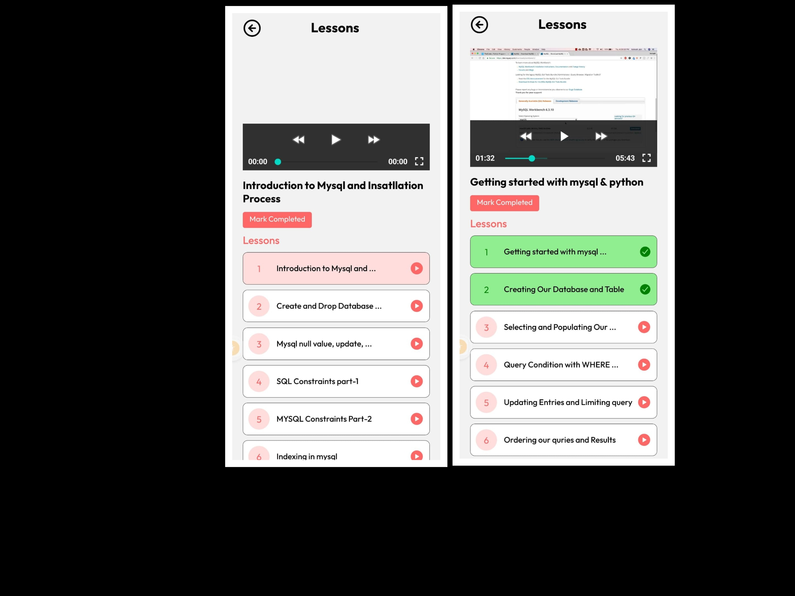

**Description**
## Easy Learning on the Go: Your Mobile LMS App

This project is a full-stack mobile learning management system (LMS) built for user convenience and accessibility. 

**Key Technologies:**

* **Frontend:** React Native Expo -  for a smooth and efficient mobile app experience.
* **Backend:** Hygraph - a flexible backend-as-a-service (BaaS) platform for managing learning content. 
* **Authentication:** Kinde - simplifies user authentication and authorization.

This LMS app empowers users to learn anytime, anywhere. Learners can access a variety of educational content, enroll in courses, and track their progress – all from the comfort of their mobile devices.

**Benefits:**

* **Convenience:** Mobile-first design allows for on-the-go learning.
* **Flexibility:** Hygraph provides a scalable backend for diverse content.
* **Security:** Kinde ensures secure user login and access control.

This project offers a user-friendly and adaptable solution for delivering educational content through a mobile platform.

  

 

 

